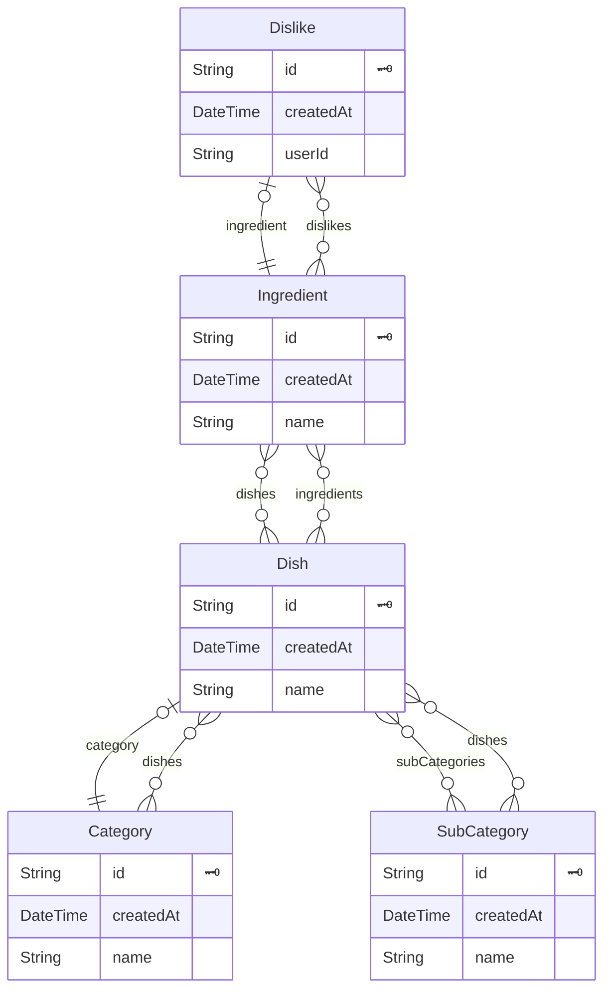

```mermaid
erDiagram

  "Dislike" {
    String id "🗝️"
    DateTime createdAt 
    String userId 
    }
  

  "Dish" {
    String id "🗝️"
    DateTime createdAt 
    String name 
    }
  

  "Ingredient" {
    String id "🗝️"
    DateTime createdAt 
    String name 
    }
  

  "Category" {
    String id "🗝️"
    DateTime createdAt 
    String name 
    }
  

  "SubCategory" {
    String id "🗝️"
    DateTime createdAt 
    String name 
    }
  
    "Dislike" o|--|| "Ingredient" : "ingredient"
    "Dish" o{--}o "Ingredient" : "ingredients"
    "Dish" o|--|| "Category" : "category"
    "Dish" o{--}o "SubCategory" : "subCategories"
    "Ingredient" o{--}o "Dish" : "dishes"
    "Ingredient" o{--}o "Dislike" : "dislikes"
    "Category" o{--}o "Dish" : "dishes"
    "SubCategory" o{--}o "Dish" : "dishes"
```
